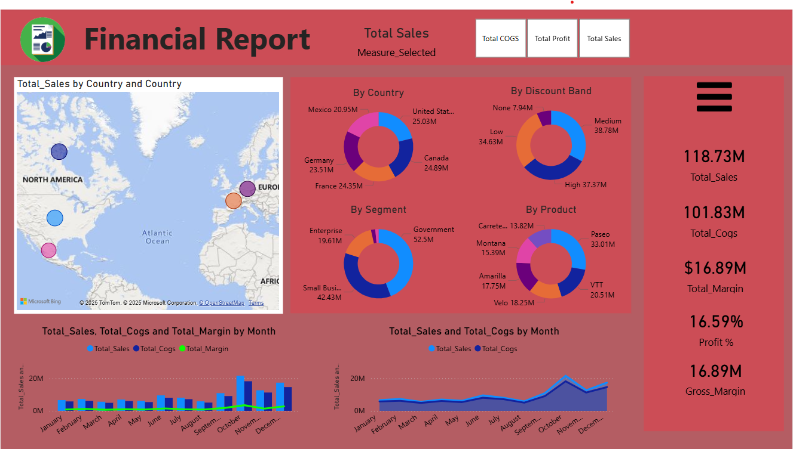
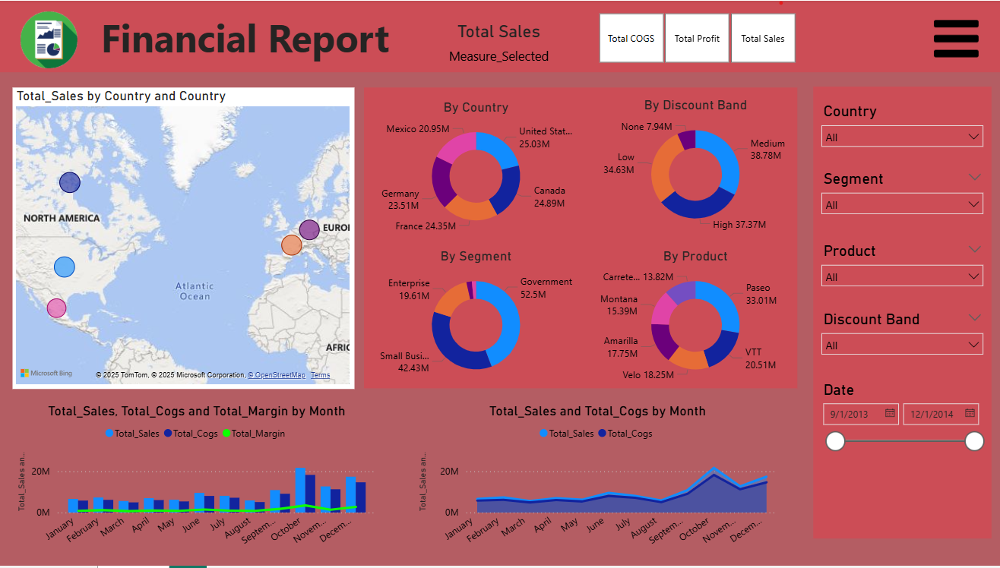

# 📊 Financial Report Dashboard

## 📌 Overview

This is a dynamic **Financial Performance Dashboard** created using **Power BI**. It provides interactive insights into total sales, cost of goods sold (COGS), profit margins, and performance trends by region, segment, product, and discount bands.

The dashboard enables decision-makers to quickly analyze and filter financial metrics across various dimensions to support strategic business decisions.

---

## 🛠️ Tools & Technologies

- Power BI Desktop
- Microsoft Excel (`Financial Sample.xlsx`)
- Power Query for data cleaning
- DAX for calculated metrics and KPIs

---

## 📂 Dataset

The dataset used is `Financial Sample.xlsx` — a sample financial dataset containing:

- Transaction dates
- Country, Segment, Product, and Discount Band
- Sales, COGS, Profit, and Units Sold

> **Note:** This is a sample dataset for educational/demo purposes.

---

## 📈 Dashboard Features

- 🌍 **Map View**: Sales by country
- 🍩 **Donut Charts**:
  - Sales by Country
  - Sales by Segment
  - Sales by Product
  - Sales by Discount Band
- 📅 **Time Series Charts**:
  - Sales, COGS, and Profit Margin trends by month
- 📊 **KPIs & Metrics**:
  - Total Sales, COGS, Profit, Gross Margin, and Profit %

---

## 📷 Screenshots

### Metrics View

### Slicer View

---

## 🧠 Key Insights

- Government segment is the top revenue generator (52.5M)
- High discount band yields highest total sales
- Paseo is the best-selling product (33M)
- Monthly sales spike in October and December

---

## 📝 How to Use

1. Open `Financial Report.pbix` in Power BI Desktop
2. Use slicers on the right to filter by:
   - Country
   - Segment
   - Product
   - Discount Band
   - Date range
3. Interact with visuals for deeper insights

---

## 🚀 Possible Enhancements

- Add YOY growth comparison
- Include RFM analysis by customer
- Embed external database for dynamic refresh

---

## 📁 Files in This Repo

| File | Description |
|------|-------------|
| `Financial Report.pbix` | Power BI dashboard |
| `Financial Sample.xlsx` | Source dataset |
| `README.md` | Project documentation |
| `Screenshot1.png` | Top half of dashboard |
| `Screenshot2.png` | Full view of dashboard |

---

## 👤 Author

**Dhairya Kalambe**  
*Aspiring Data Analyst | Power BI Enthusiast*  
[LinkedIn](#) • [Portfolio](#)
